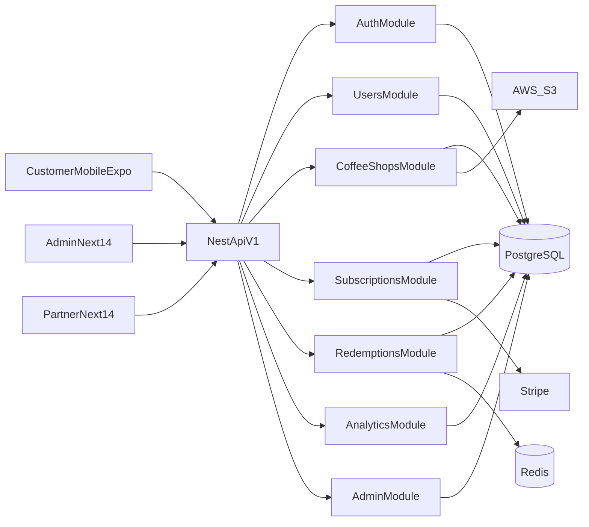

# Big Cup Club

Production-grade SaaS scaffold for a subscription-based coffee marketplace.

## System Architecture



## Workspace Structure

```text
apps/
  api/            # NestJS backend
  mobile/         # Expo customer app
  admin-web/      # Next.js admin dashboard
  partner-web/    # Next.js coffee shop dashboard
packages/
  config/         # Shared tsconfig/tailwind
  contracts/      # Shared API contracts
  ui/             # Reusable design system components
  utils/          # Shared utility functions
```

## Backend API Routes (v1)

- `POST /v1/auth/register`
- `POST /v1/auth/login`
- `POST /v1/auth/refresh`
- `POST /v1/auth/oauth/google`
- `POST /v1/auth/oauth/apple`
- `POST /v1/auth/password/reset/request`
- `POST /v1/auth/password/reset/confirm`
- `GET /v1/users/me`
- `GET /v1/coffee-shops`
- `GET /v1/subscriptions/plans`
- `POST /v1/subscriptions/webhook`
- `POST /v1/redemptions/qr-token`
- `POST /v1/redemptions/redeem`
- `GET /v1/analytics/platform`
- `GET /v1/admin/users`
- `GET /v1/admin/coffee-shops`
- `GET /v1/partner/dashboard`
- `GET /v1/partner/orders`
- `PATCH /v1/partner/orders/:id/status`
- `GET /v1/campaigns`
- `POST /v1/campaigns`
- `GET /v1/support/tickets`
- `POST /v1/support/tickets`
- `GET /v1/notifications`
- `POST /v1/notifications/mark-read`

## Role Model

Application roles include:

- `customer`
- `owner`
- `manager`
- `staff`
- `admin`
- `finance_admin`
- `support_admin`
- `marketing_admin`
- `super_admin`

## QR Redemption Flow

1. Customer opens wallet and requests `POST /v1/redemptions/qr-token`.
2. API creates one-time `QrToken` (60-second expiry).
3. Owner scanner submits `POST /v1/redemptions/redeem`.
4. API validates token state, expiry, user subscription, and cups balance.
5. API transaction atomically:
   - decrements cup balance
   - records redemption
   - records transaction ledger
   - marks QR token used

## Authentication and Security

- JWT access and refresh tokens
- Password hashing with bcrypt
- Role-based access control (`customer`, `owner`, `admin`)
- Throttling with Nest Throttler
- Replay protection via one-time QR token usage
- Stripe webhook idempotency table

## Database Schema

Prisma models include:

- `User`
- `SubscriptionPlan`
- `Subscription`
- `CoffeeShop`
- `Order`
- `QrToken`
- `Redemption`
- `Transaction`
- `Reward`
- `Campaign`
- `AdminLog`
- `StripeWebhookEvent`
- `PasswordResetToken`

## UI Design Theme

- Primary `#2B1E1A` (Deep Espresso)
- Secondary `#F6F1EB` (Latte Cream)
- Accent `#C97B36` (Caramel)
- Highlight `#4AD6A5` (Mint Green)
- Neutral `#6B6B6B` (Slate Grey)
- Typography: Inter + DM Sans

Reusable UI components are in `packages/ui`:

- `PageShell`, `SectionHeader`, `SurfaceCard`
- `Button`, `StatusChip`, `DataTable`
- `KpiCard`, `EmptyState`, `SkeletonBlock`
- plus legacy aliases (`MetricCard`, `AdminTable`, etc.) for compatibility

## Platform Maturation Updates

- API hardening now includes:
  - hashed password-reset tokens with no token leakage in non-development environments
  - owner-scoped notification updates and support ticket ownership enforcement
  - tenant checks in partner and redemption operations
  - global throttling guard and stricter auth endpoint throttle limits
  - Stripe webhook signature verification with raw-body checks
  - request-id structured request logging and Prisma error normalization
- Admin and Partner web apps now share upgraded shells, loading/error boundaries, and richer operational page structures instead of single-line placeholders.
- Mobile now uses tokenized theme primitives, typed tab navigation, and resilient loading/error states for core screens.

## Single localhost demo

To run **one app** with a **mode toggle** (Customer / Coffee Shop / Admin) on a single URL:

1. Start the API (optional, for live data): `pnpm --filter @bigcup/api dev`
2. Start the demo: `pnpm run dev:demo`
3. Open **http://localhost:3000** and use the top bar to switch between **Customer**, **Coffee Shop**, and **Admin** views.

All three experiences run on the same origin; the API runs on port 4002 (see `apps/demo/.env.local`).

The demo frontend includes:
- premium theme shell with warm gradient mesh background
- animated mode toggle with smooth page transitions
- premium Customer / Partner / Admin compositions
- explicit preview states (Live, Loading, Empty, Error) for each mode
- responsive card/table layouts and focus-visible interactions

To run on a different host port:
- `pnpm --filter @bigcup/demo exec -- next dev -p 3100`
- then open `http://localhost:3100`

## Deploy and Run

1. Install dependencies:
   - `pnpm install`
2. Start local infrastructure (requires Docker Desktop):
   - `pnpm run db:up` (or `docker compose up -d postgres redis`)
3. Generate Prisma client and migrate:
   - `pnpm --filter @bigcup/api prisma:generate`
   - `pnpm run db:migrate`
4. Seed plans/admin:
   - `pnpm run db:seed`
5. Run all apps:
   - `pnpm dev`

Or run services individually (from repo root):
- API: `pnpm --filter @bigcup/api dev` (default port **4002** if 4000 is in use; see `apps/api/.env`)
- Admin: `pnpm --filter @bigcup/admin-web dev` → **http://localhost:3001**
- Partner: `pnpm --filter @bigcup/partner-web dev` → **http://localhost:3002**

The dashboards call the API using `NEXT_PUBLIC_API_URL` (see `apps/admin-web/.env.local` and `apps/partner-web/.env.local`). Without Postgres/Redis, the API starts but data endpoints return 500 until you run `db:up`, `db:migrate`, and `db:seed`.

## Deployment Architecture

- `apps/demo`, `apps/admin-web`, and `apps/partner-web` deploy to Vercel.
- `apps/api` deploys to AWS ECS/Fargate (or EKS) with RDS PostgreSQL + ElastiCache Redis.
- Media assets use S3.
- Stripe webhooks routed to API public endpoint.

### Vercel deployment (monorepo)

To deploy the demo app (or another Next.js app) to Vercel:

1. Import the repo in Vercel and create a project.
2. In **Project Settings → Build & Deployment → Root Directory**, set **Root Directory** to:
   - `apps/demo` (for the unified demo) — recommended
   - `apps/admin-web` (for the admin dashboard)
   - `apps/partner-web` (for the partner dashboard)
3. Leave **Build Command** and **Output Directory** on their defaults (Vercel will detect Next.js).
4. Ensure `NEXT_PUBLIC_API_URL` is set in Environment Variables if the frontend needs the API.

For multiple apps, create separate Vercel projects, each with its own Root Directory pointing to one of the app folders.
